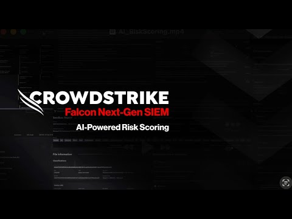
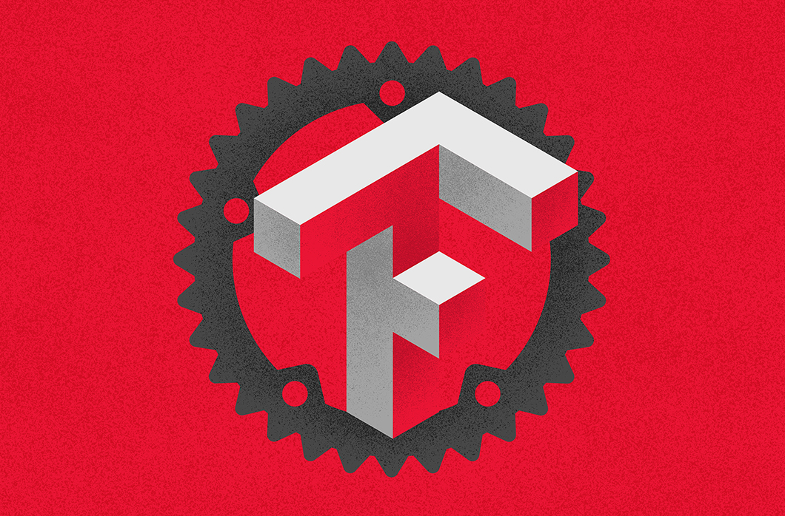

## Public Patent Applications

::: {.patent-grid}
::: {.patent-card}
### Source Code Programming Language Prediction
**US20240086187A1**

Machine learning system for classifying source-code programming language from source-code artifacts.

[Google Patents](https://patents.google.com/patent/US20240086187A1/en){.card-link target="_blank"}
:::

::: {.patent-card}
### Behavior-Based Asset Classifications
**US20250202921A1**

Behavior-based classification methods for cybersecurity assets using observed activity and contextual signals.

[Google Patents](https://patents.google.com/patent/US20250202921A1/en){.card-link target="_blank"}
:::

::: {.patent-card}
### Session-Based Anomaly Detection on Cloud Logs
**US20250233875A1** / **EP4586117A1**

Operational prediction on user-based contextual sessions, including anomaly detection on cloud log activity.

[US filing](https://patents.google.com/patent/US20250233875A1/en){.card-link target="_blank"} [EP filing](https://patents.google.com/patent/EP4586117A1/en){.card-link target="_blank"}
:::

::: {.patent-card}
### Multi-Modal Breach Detection with Time-Aware Graph ML
**US20260095470A1**

Cybersecurity breach prediction using multiple data modalities and graph-based machine learning methods.

[Google Patents](https://patents.google.com/patent/US20260095470A1/en){.card-link target="_blank"}
:::

::: {.patent-card}
### False-Positive Prevention with Multi-Modal Data and Graph ML
**US20260089177A1**

Prediction of false-positive cybersecurity detections using multi-modal analysis and graph ML.

[Google Patents](https://patents.google.com/patent/US20260089177A1/en){.card-link target="_blank"}
:::

::: {.patent-card}
### Interpretable ML-Based Alert Grouping for NextGen SIEM
**US20260111548A1**

Interpretable cybersecurity detection grouping for analyst triage and alert investigation workflows.

[Google Patents](https://patents.google.com/patent/US20260111548A1/en){.card-link target="_blank"}
:::
:::

## Technical Articles & Media

::: {.pub-entry}
{.pub-thumbnail}

**AI-Powered Risk Scoring with Falcon Next-Gen SIEM**
CrowdStrike &middot; Feature video

Data science lead for the ML-powered risk scoring system that helps analysts prioritize high-priority threats in Falcon Next-Gen SIEM.

[Watch video](https://www.youtube.com/watch?v=KaIaOXZMVi4){.pub-link target="_blank"}
:::

::: {.pub-entry}
{.pub-thumbnail}

**How CrowdStrike Achieves Lightning-Fast Machine Learning Model Training with TensorFlow and Rust**
CrowdStrike Engineering Blog &middot; June 2022

Technical article on reducing ML model training time from 227 hours to 6 hours through Rust-based feature extraction, GPU infrastructure, and TensorFlow input-pipeline optimization.

[Read article](https://www.crowdstrike.com/en-us/blog/how-crowdstrike-achieves-fast-machine-learning-model-training-with-tensorflow-and-rust/){.pub-link target="_blank"}
:::

::: {.pub-entry}
{.pub-thumbnail}

**New CrowdStrike Research Challenges Container Predictability Assumptions**
CrowdStrike Engineering Blog &middot; October 2024

Research article analyzing billions of container events across popular applications and testing assumptions about workload predictability.

[Read article](https://www.crowdstrike.com/en-us/blog/new-crowdstrike-research-challenges-containerized-workload-predictability-assumption/){.pub-link target="_blank"}
:::
