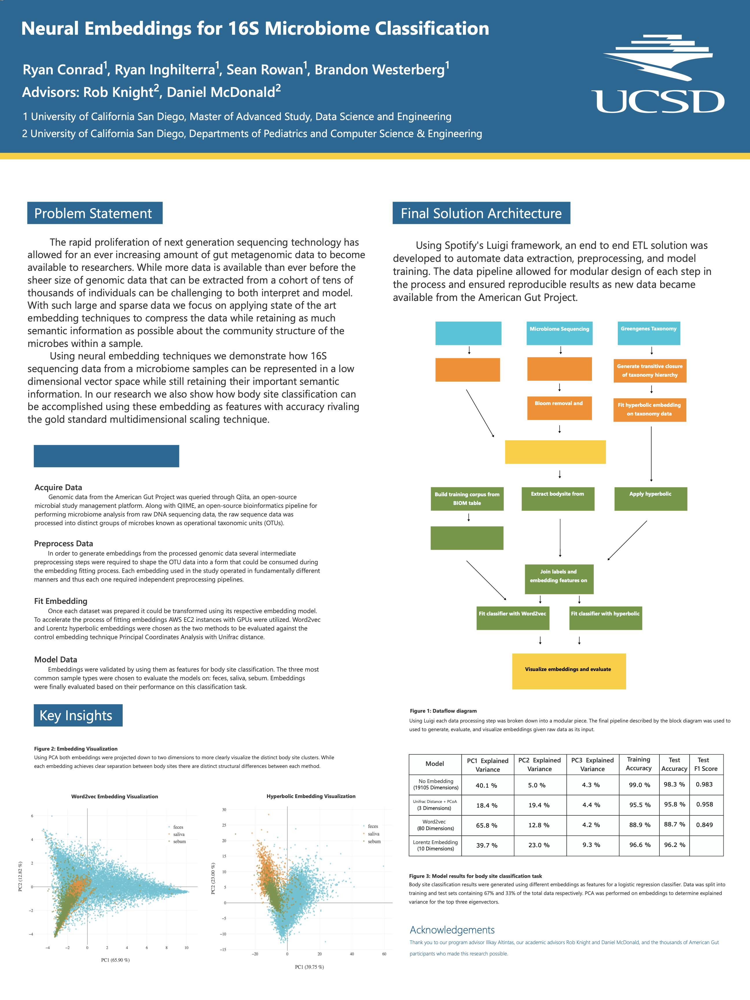

## Overview

Masters capstone project analyzing the American Gut Project dataset using advanced neural embedding techniques and supervised machine learning to classify microbiome samples based on IgG (Immunoglobulin G) levels. Built a complete data science pipeline handling bioinformatics data ingestion, phylogenetic diversity analysis, novel embedding approaches, and predictive modeling.

**Publication:** [UCSD Library Digital Collections](https://library.ucsd.edu/dc/object/bb2666864s/_4_1.pdf)

**Interactive Dashboard:** [Live Demo](https://github.com/mas-dse-ringhilt/american_gut_capstone_dashboard)

## Key Contributions

### Neural Embedding Techniques for Microbiome Data
- **Hyperbolic embeddings** capturing hierarchical structure of microbiome taxonomy
- **Word2Vec embeddings** treating microbiome samples as documents and OTUs as words
- **3D visualization** of embedding space showing sample clustering patterns
- Novel application of NLP neural network architectures to biological sequence data

### Classification Performance
Achieved strong predictive performance across multiple embedding approaches and classifiers, with results showing:
- Comparative evaluation of Random Forest, XGBoost, and neural network classifiers
- Analysis across different embedding dimensionalities and feature representations
- Balanced accuracy metrics for microbiome-based phenotype prediction

### Production Data Pipeline Architecture
- Built scalable **Luigi-based pipeline** for reproducible end-to-end analysis
- **AWS S3 integration** for distributed data artifact management
- Modular architecture with distinct stages: data ingestion → preprocessing → embedding → modeling → evaluation
- Automated dependency management and task orchestration

### Comprehensive Bioinformatics Workflow
- **Phylogenetic diversity**: Alpha and beta diversity calculations using GreenGenes 97 reference tree
- **Principal Coordinates Analysis (PCoA)** on weighted/unweighted UniFrac distance matrices
- **Bloom OTU removal** and rarefaction normalization for data quality control
- Integration of BIOM format microbiome data via Redbiom API

### Data Engineering & Integration
- Cleaned and integrated data from 3 heterogeneous sources: raw metadata, BIOM OTU tables, and drug questionnaires
- Implemented multiple imputation techniques: SoftImpute, KNN, and Iterative Imputer for missing data handling
- Created consistent sample ID schema joinable across datasets
- Feature engineering from sparse OTU count matrices

## Technical Architecture

**Data Pipeline Components:**
1. **Biom Data Ingestion** — Pulls American Gut Project OTU data from Redbiom API, removes bloom OTUs, applies rarefaction
2. **Diversity Analysis** — Calculates phylogenetic alpha/beta diversity and runs PCoA
3. **Data Integration** — Cleans and joins metadata, BIOM, and survey data
4. **Embedding Layer** — Generates hyperbolic and Word2Vec embeddings
5. **ML Pipeline** — Preprocessing, feature engineering, hyperparameter tuning, and classification

**Technologies:**
- Python (Luigi, scikit-learn, pandas, numpy)
- Bioinformatics tools (QIIME2, BIOM format, Redbiom)
- AWS S3 for distributed data storage
- Interactive Plotly dashboard for visualization

## Artifacts

- **Code Repository:** [GitHub](https://github.com/mas-dse-ringhilt/DSE-American-Gut-Project)
- **Publication:** [Digital Thesis](https://library.ucsd.edu/dc/object/bb2666864s/_4_1.pdf)
- **Interactive Dashboard:** [Embedding Visualizations](https://github.com/mas-dse-ringhilt/american_gut_capstone_dashboard)

## Impact

This work demonstrates how modern machine learning and embedding techniques from NLP can be successfully adapted to biological data, opening new approaches for microbiome analysis beyond traditional ecological metrics. The production-grade pipeline architecture enables reproducible research and supports future extensions to other microbiome datasets.

---

*Masters in Data Science Capstone Project, UC San Diego (2018)*
