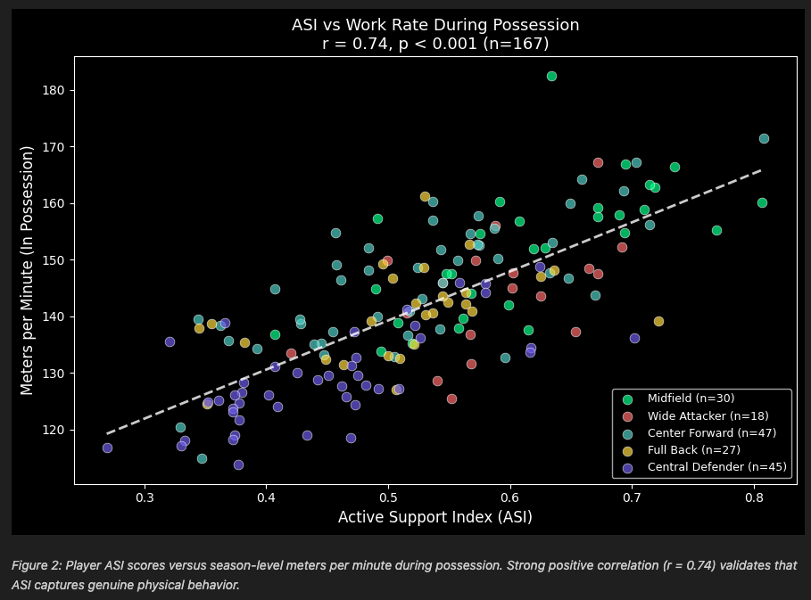

# The Active Support Index (ASI): Quantifying Off-Ball Movement During Pressure Events

## Abstract

### Introduction

On average, players spend 98% of a match without the ball, yet football analytics overwhelmingly focuses on the 2% with it. With the latest advancements in computer vision, a golden opportunity to derive metrics and insights from off-ball movement is now possible.

**Core Question:** When a ball carrier is pressured, how actively do teammates move to provide passing options?

This research introduces the **Active Support Index (ASI)**, a metric framework leveraging SkillCorner tracking and dynamic event data to measure teammate support during pressure moments, validated against season-level physical output. Applications include identifying players who consistently provide active support, diagnosing static tendencies for coaching intervention, and comparing team tactical styles.

### Methods

We analyzed 10 A-League 2024/25 matches containing 7,063 pressure events using SkillCorner's 10fps tracking data. Player velocities were calculated using a Savitzky-Golay filter (window=7 frames, polynomial degree=2) applied to positional data.

**Metric Definitions:**

| Level | Metric | Formula |
|-------|--------|---------|
| Per Event | Active Support Ratio | $\frac{\text{Active Supporters}}{\text{Nearby Teammates}}$ |
| Per Player | Player ASI | $\frac{\text{Active Support Count}}{\text{Support Opportunities}}$ |
| Per Team | Team ASI | $1 - \text{Static Rate}$ |

**Key Definitions:**
- **Active Supporter**: Teammate within 35m of the pressed player AND moving >2 m/s
- **Static Rate**: Proportion of pressure events with zero active supporters
- **Proximity threshold (35m)**: Maximum realistic passing range under pressure
- **Velocity threshold (2 m/s)**: Boundary separating walking from jogging/running

For validation, we compared player ASI scores (calculated from 10 tracking matches) against season-level physical aggregates from 175 A-League matches, specifically meters per minute during team possession (`total_metersperminute_full_tip`).

### Results

**Single Event Analysis**

Figure 1 shows a pressure event with low Active Support Ratio where only 1 of 9 nearby teammates (11%) was actively moving—8 teammates were static.


**Validation with Physical Aggregates**

ASI correlates strongly with season-level physical output (r = 0.74, p < 0.001, n = 167). Players in the top ASI quartile cover 153.2 m/min versus 128.8 m/min for the bottom quartile—a 19% difference (Figure 2).



**Additional Findings**

- *Position Validation:* ASI aligns with expected positional demands. Midfielders average 59.4% ASI versus 45.2% for defenders (p < 0.001).
- *Team Differentiation:* Team ASI ranges from Perth Glory (98.3%) to Macarthur FC (91.5%), a 7-point spread indicating ASI can differentiate team off-ball movement cultures.
- *Fatigue Analysis:* 58% of players (n=151) showed declining ASI in the second half, with average support ratio dropping from 53.7% to 53.1% (p = 0.46, not significant).

### Conclusion

The Active Support Index provides a quantitative framework for measuring off-ball support during pressure events. The strong correlation with independent physical aggregate data (r = 0.74 across 175 matches) validates that ASI captures real physical behavior rather than arbitrary thresholds. Applications include identifying players who consistently provide active support under pressure, diagnosing static tendencies for coaching intervention, and comparing team tactical styles.


---

## Installation & Usage

### Option 1: Run in Google Colab

No setup required. Simply click the badge below to open and run the notebook directly in Google Colab:

[](https://colab.research.google.com/github/ringhilterra/analytics_cup_research/blob/main/submission.ipynb)

### Option 2: Run Locally

Tested on Python 3.12 (macOS)

1. Clone the repository:
   ```bash
   git clone https://github.com/ringhilterra/analytics_cup_research.git
   cd analytics_cup_research
   ```

2. Install dependencies:
   ```bash
   pip install -r requirements.txt
   ```

3. Run the notebook:
   ```bash
   jupyter notebook submission.ipynb
   ```

---