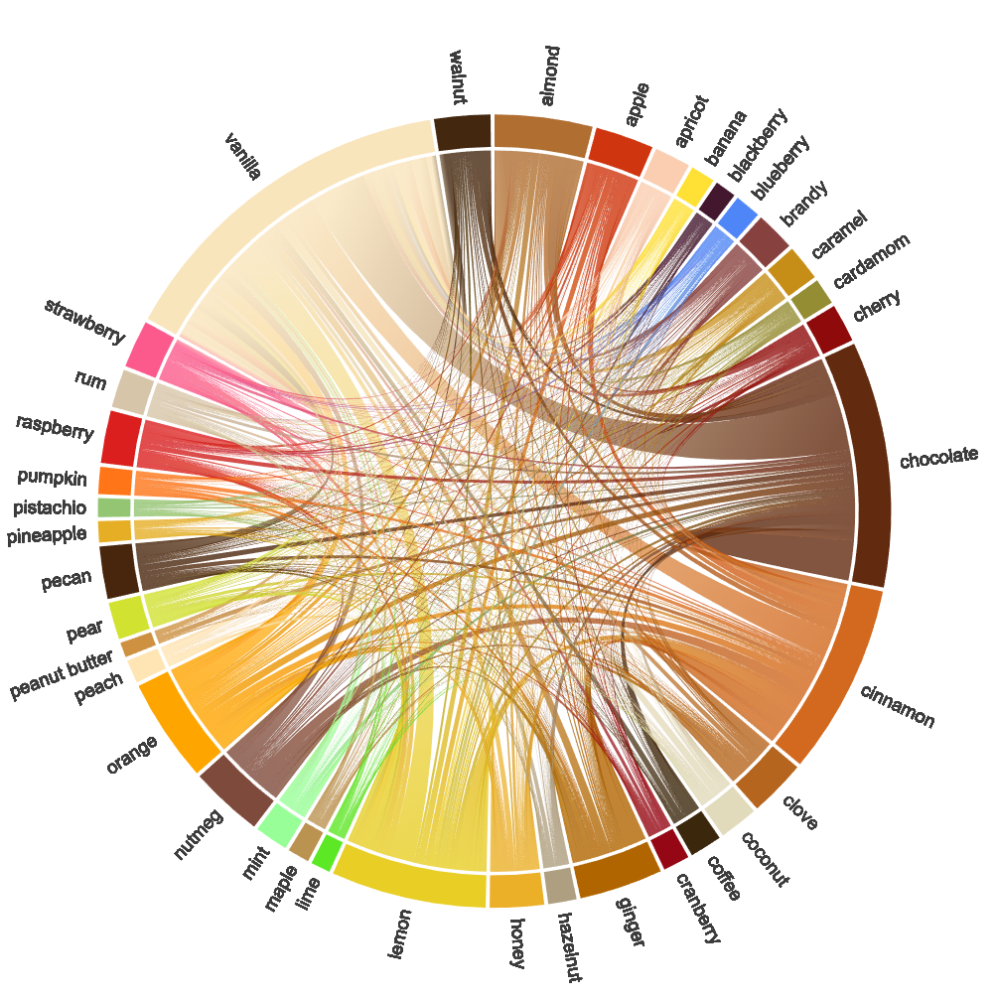

## Overview

Interactive visualization of dessert flavor pairings using a chord plot in Python. Explores which dessert flavors pair together most frequently based on recipe data from Kaggle.

**Interactive site:** [ringhilterra.github.io/dessert-flavor-pairings](https://ringhilterra.github.io/dessert-flavor-pairings/)

**Data source:** [Kaggle — Dessert Flavor Combinations](https://www.kaggle.com/keytarrockstar/dessert-flavor-combinations)

## Code

[GitHub Repository](https://github.com/ringhilterra/dessert-flavor-pairings) 
