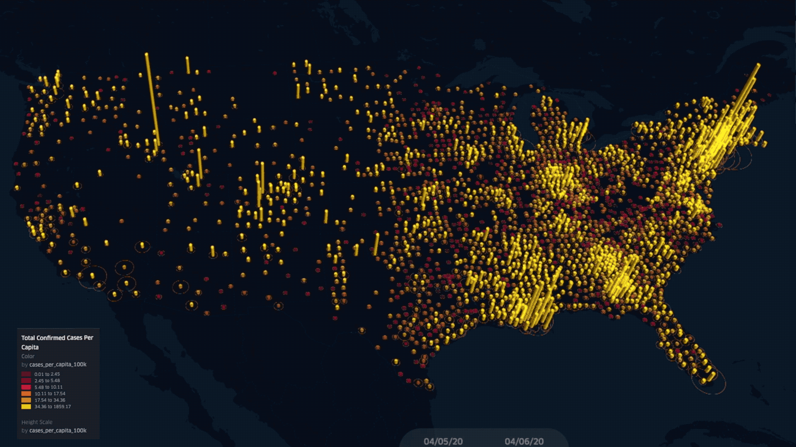

## Overview

An enriched, updating dataset combining NYTimes COVID-19 data with county-level geospatial shapes, 2019 census population estimates, population densities, demographics, and calculated per capita metrics.

**Enrichments include:**

- County shapes and center point coordinates
- 2019 census population estimates and population density
- County-level demographic breakdowns
- Per capita cases/deaths calculations and daily new case/death metrics

**Kaggle analysis:** [COVID19 U.S. Analysis and Visualization](https://www.kaggle.com/ringhilterra17/covid19-05-04-20-u-s-analysis-visualization)

**Visualization:** [COVID-19 U.S. Time-lapse on r/dataisbeautiful](https://www.reddit.com/r/dataisbeautiful/comments/fxqh6u/oc_covid19_us_timelapse_confirmed_cases_per/)

## Code

[GitHub Repository](https://github.com/ringhilterra/enriched-covid19-data)
