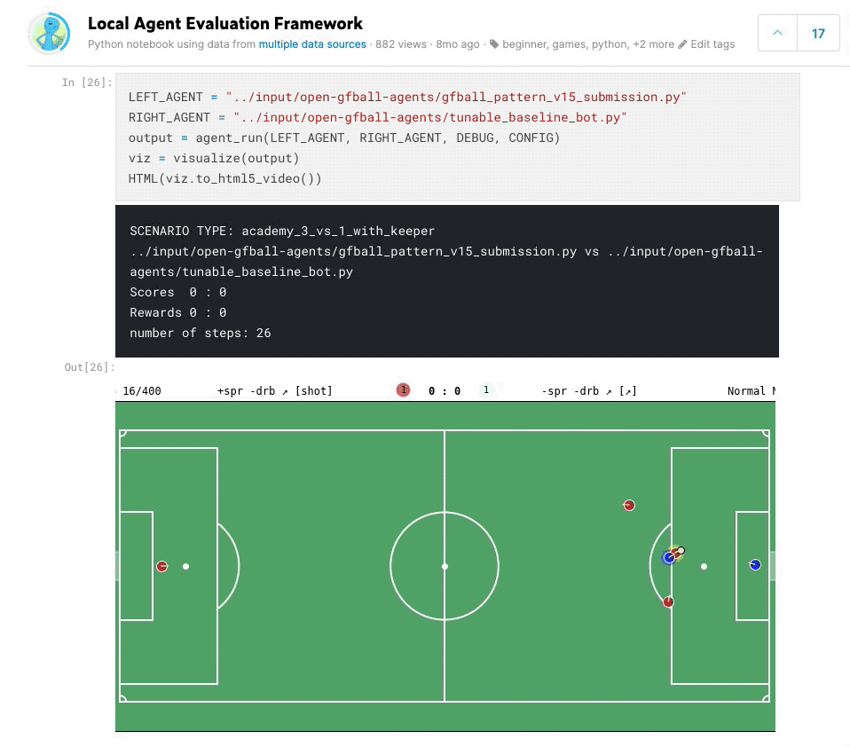

## Overview

Entry for the [Google Research Football with Manchester City F.C.](https://www.kaggle.com/c/google-football/overview) Kaggle simulation competition. The project includes a Dockerized development environment for the Google Research Football simulator, agent implementations, and analysis notebooks.

## Local Agent Play Framework

I built a framework for pool play simulation matches between different agents and published it as a notebook on Kaggle.

## Repository Structure

- **Docker environment** for the Kaggle + Google Football simulation, with Jupyter notebook support
- **Agent implementations** and ML agent exploration
- **Analysis notebooks** for match simulation and evaluation

## Code

[GitHub Repository](https://github.com/ringhilterra/kaggle-google-football-sim)
