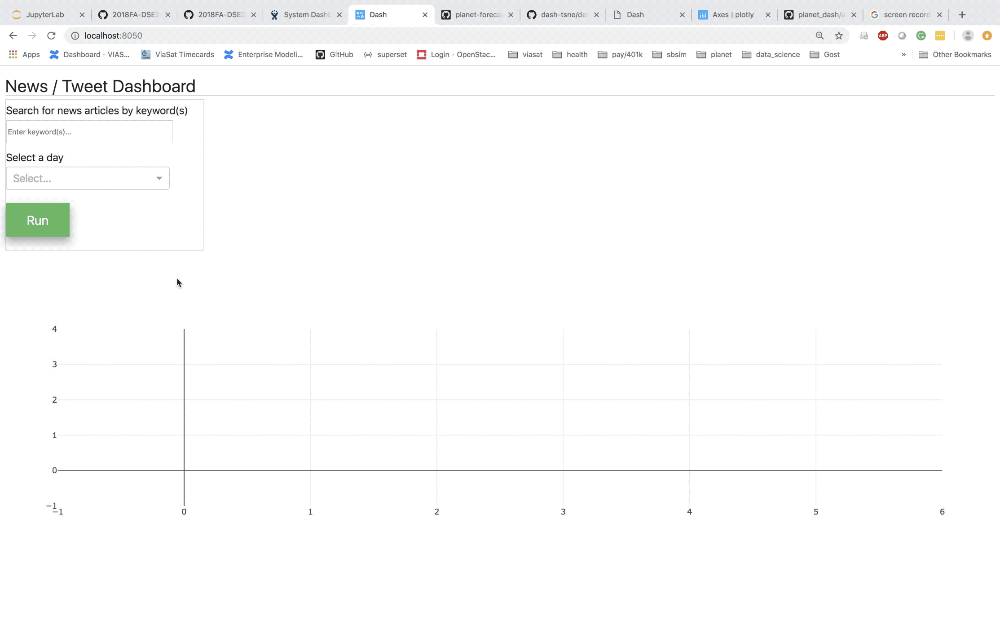
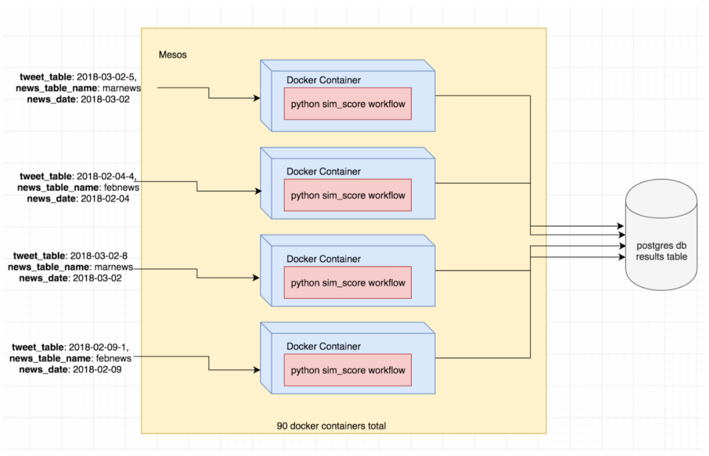

## Overview

Links tweets with news articles based on text content similarity using NLP techniques. Uses distributed computing (Mesos + Docker) to run the similarity score pipeline in parallel for speedup.

**Components:**

- **Similarity pipeline** — NLP-based text similarity scoring between tweets and news articles
- **Distributed computing** — Mesos and Docker pipeline for parallel processing
- **Interactive dashboard** — Dash app to view and interact with similarity results

## Code

[GitHub Repository](https://github.com/ringhilterra/news-tweets-nlp-link)
