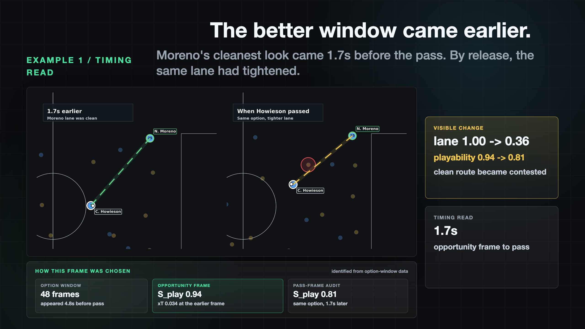
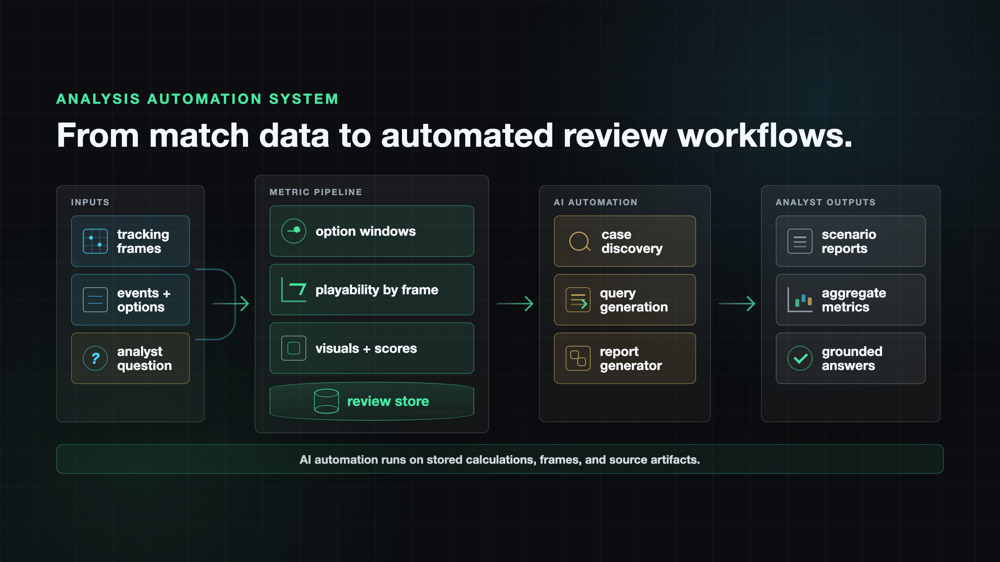

::: {.callout-note}
## Pitch to the Pros 3 finalist
I was selected as one of four finalists for Training Ground Guru's Pitch to the Pros 3 and presented this work to professionals in the game.
:::

## Was the Best Pass Really Playable?

::: {.presentation-recording}
### Presentation recording

Unlisted recording of my Pitch to the Pros 3 finalist presentation for "Was the Best Pass Really Playable?"

<iframe class="youtube-embed" src="https://www.youtube.com/embed/x-L0k6DRIec" title="Pitch to the Pros 3 finalist presentation recording" loading="lazy" allow="accelerometer; autoplay; clipboard-write; encrypted-media; gyroscope; picture-in-picture; web-share" allowfullscreen></iframe>

[Watch on YouTube](https://www.youtube.com/watch?v=x-L0k6DRIec){target="_blank"}
:::

[View the presentation deck](deck/decision_friction_final.html){.btn .btn-primary target="_blank"} [View the analyst report example](deck/report_scroll/case1_analyst_report.html){.btn .btn-outline-primary target="_blank"}

{.pitch-preview-image}

## What I Built

- A pass-window review workflow that scans candidate pass options before release.
- A playability score built from lane access, pressure, receiver freedom, movement fit, and timing.
- Case-study visuals showing how an option can be clean earlier, constrained later, or never realistically open.
- A prototype analyst export that packages frames, scores, and review evidence into a shareable report.

## Data and Method

The finalist deck was built on open SkillCorner tracking and event data from 10 Australian A-League 2024/25 matches. The analysis used 9.6M player-frame tracking samples, 47.9K dynamic events, and 24.4K linked passing options.

SkillCorner passing options define candidate actions, SkillCorner xThreat estimates potential value, and tracking data supplies the geometry for execution context. The output is designed for practitioner review: ranked alternatives, timing status, primary constraints, and evidence that can be checked visually.

## Deck Highlights

::: {.deck-highlight-grid}
::: {.deck-highlight-card}

**Timing read:** shows how a high-value option can be clean earlier and more constrained by the actual release frame.
:::

::: {.deck-highlight-card}

**Analysis automation system:** shows how the metric pipeline can scale from individual pass reviews into repeatable analyst workflows.
:::
:::
