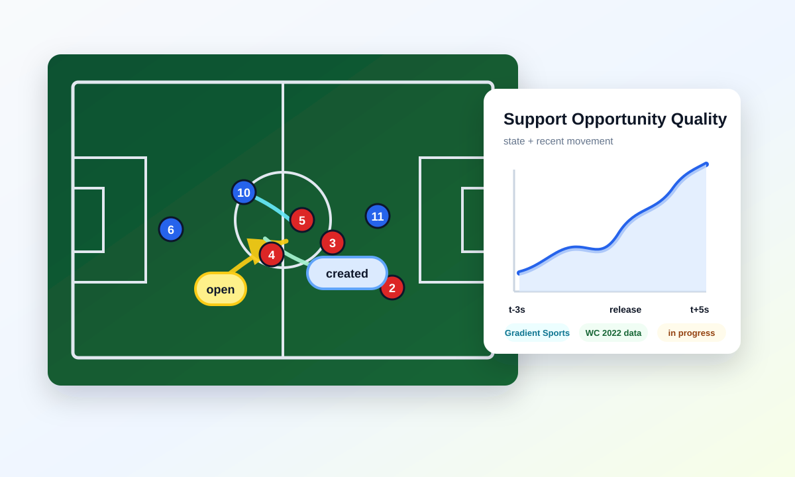

::: {.callout-note}
## Current status
Active research collaboration, 2026-present. This page describes the project direction and implementation groundwork; it is not presented as a completed or published paper.
:::

::: {.evidence-hero}
{.evidence-hero-img}

::: {.evidence-hero-copy}
## From "who is open?" to "how did that option emerge?"

I am collaborating with Rui Marcelino, Professor at the University of Maia and sports scientist with the Portuguese Football Federation men's beach soccer team, on a research project about off-ball support creation.

The goal is to move from static availability to temporal support dynamics: how teammate movement creates, improves, weakens, or removes useful options before the possession outcome happens.

[Back to football analytics](../../football-analytics.qmd){.btn .btn-primary}
:::
:::

## Research Question

Most football analytics work evaluates available options at a moment in time: pass completion probability, receiver selection, pitch control, or action value. This project asks a different question:

> How did teammate movement create, improve, weaken, or remove support opportunities before the possession outcome happened?

The working hypothesis is that possessions with positive support creation dynamics should be more likely to retain the ball, progress territorially, and increase attacking threat than possessions where the support environment remains static or deteriorates.

## Working Framework

The core metric is **Temporal Support Opportunity Quality (SOQ)**. SOQ combines the current support state with how that state evolved over the previous seconds.

::: {.metric-grid}
::: {.metric-card}
### Instantaneous State
- Number of available options
- Support distance and angle
- Passing lane openness
- Defender obstruction
- Pressure and local space
:::

::: {.metric-card}
### Temporal Evolution
- Options created or lost
- Passing lanes opened or closed
- Space gained through movement
- Defender displacement
- Support stability and volatility
:::

::: {.metric-card}
### Possession Outcomes
- Retention after short horizons
- Progressive passes or carries
- Final-third entries
- Future xT, EPV, or related value change
:::
:::

## Data and Implementation

The primary implementation work is being built on **Gradient Sports 2022 FIFA World Cup tracking and event data**, formerly distributed as PFF FC data. SkillCorner open data remains useful as a comparison point because my original Active Support Index work was built on SkillCorner tracking and dynamic events.

The groundwork so far has focused on making the data layer reliable before extending the support metric:

- A reusable Gradient/PFF processing layer for loading, normalizing, synchronizing, enriching, and exporting clean match data.
- Direction normalization so the home team attacks left-to-right across the full match, while preserving raw coordinates.
- Event-to-tracking synchronization using the provider's stamped `possession_event_id` rather than estimated frame matching.
- Pressure-event handling using `pe_pressurePlayerId`, which is a closer analogue to pressure events than challenge-only subsets.
- Speed and pressure enrichment with explicit handling for unknown speed values instead of silently treating missing data as stationary.
- A clean Parquet bundle design for tracking, events, players, and metadata so the research metric can sit on top of a tested data contract.

The method is designed to stay interpretable:

1. Identify possession sequences with the ball in play and a meaningful possession structure.
2. Build frame-level support features for availability, lane quality, pressure, space, and team structure.
3. Add temporal features that measure how those conditions changed over recent seconds.
4. Calibrate SOQ components with interpretable supervised models such as logistic regression, Elastic Net, or GAMs.
5. Validate support creation dynamics against retention, progression, and threat outcomes.

## Validation Plan

The validation work is the important part. A useful support metric should explain more than the obvious context already captured by pitch location, pressure on the ball carrier, or number of nearby teammates.

Planned comparisons include:

- Retention after 3, 5, and 10 seconds.
- Territorial progression through passes, carries, and entries into advanced areas.
- Future threat generation using xT, EPV, or related possession value metrics.
- Baselines using ball-carrier pressure, pitch location, nearby teammates, and static support measures.

## Exploratory Archetypes

A secondary strand of the project looks for recurring support creation patterns through unsupervised learning. Candidate archetypes include check-to-ball support, lateral escape support, progressive support runs, width creation, and third-man support movements.

The intent is descriptive and practical: give analysts a way to review not only whether support existed, but what kind of movement created it.

## Why It Matters

For a club environment, this type of work can connect tracking data to questions coaches and analysts already ask:

- Which players consistently create useful options for teammates?
- When does movement create a better decision window for the ball carrier?
- Which possession structures retain the ball under pressure?
- How can analysts review support quality in a way that is both quantitative and visually checkable?

The project fits my broader football analytics focus: building reproducible, interpretable models that turn event and tracking data into decision-support tools.
