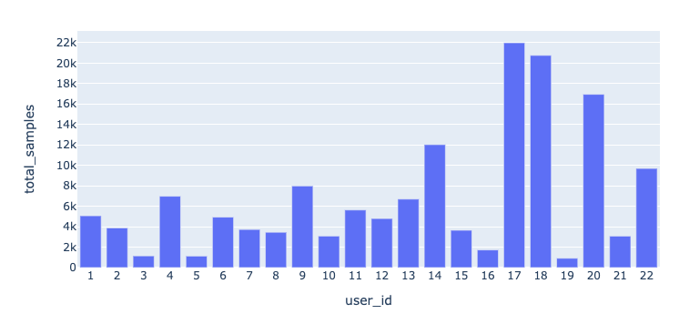

## Overview

Multiclass classification project identifying users from smartphone accelerometer data collected during walking activity (22 participants). Compares traditional feature engineering with time series windowing (Random Forest) against state-of-the-art ROCKET (Random Convolutional Kernels) classifier.

**Key results:**

| Classifier | Test Accuracy | Balanced Accuracy |
|------------|:---:|:---:|
| RF Window 50 | 0.61 | 0.54 |
| ROCKET Window 100 | **0.70** | **0.61** |

ROCKET significantly outperforms Random Forest using only raw x, y, z features — no manual feature engineering required.

**Dataset:** [UCI — User Identification From Walking Activity](https://archive.ics.uci.edu/ml/datasets/User+Identification+From+Walking+Activity)

## Code

[GitHub Repository](https://github.com/ringhilterra/time-series-user-classification)
