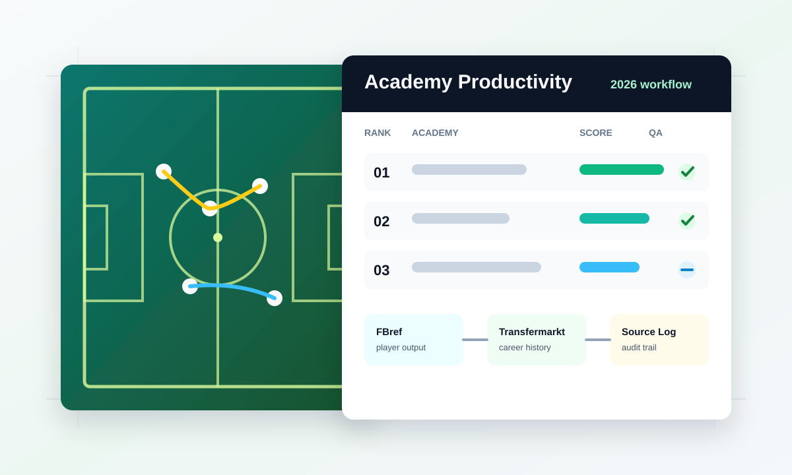

::: {.callout-note}
## Current status
Active consulting engagement, 2026-present. This page describes the scope and methodology of the work in progress; public outputs will be linked when available.
:::

::: {.evidence-hero}
{.evidence-hero-img}

::: {.evidence-hero-copy}
## Rebuilding an academy ranking workflow

I was contracted by Training Ground Guru to rebuild the Academy Productivity Rankings analysis and co-author the annual article. The work focuses on making the ranking process more automated, reproducible, auditable, and easier to update across public player and academy data sources.

[Back to football analytics](../../football-analytics.qmd){.btn .btn-primary}
:::
:::

## Project Scope

The project turns a manually intensive annual analysis into a structured data workflow for evaluating academy player-development contribution across the English academy system.

The work includes:

- Building AI-enhanced web scraping and data ingestion automation for public player-history sources such as FBref and Transfermarkt.
- Resolving player and academy histories into an analysis-ready dataset.
- Updating the scoring methodology for academy productivity.
- Building a reproducible ranking pipeline with source tracking and quality checks.
- Supporting the written analysis for the annual Training Ground Guru article.

## Methodology Focus

The important technical challenge is not just collecting data. The ranking needs a defensible chain from source evidence to final score:

1. Identify relevant players and club histories.
2. Normalize source data into consistent player, club, age, and competition fields.
3. Track provenance so each ranking input can be checked.
4. Apply scoring logic in a repeatable pipeline.
5. Review edge cases before publication.
